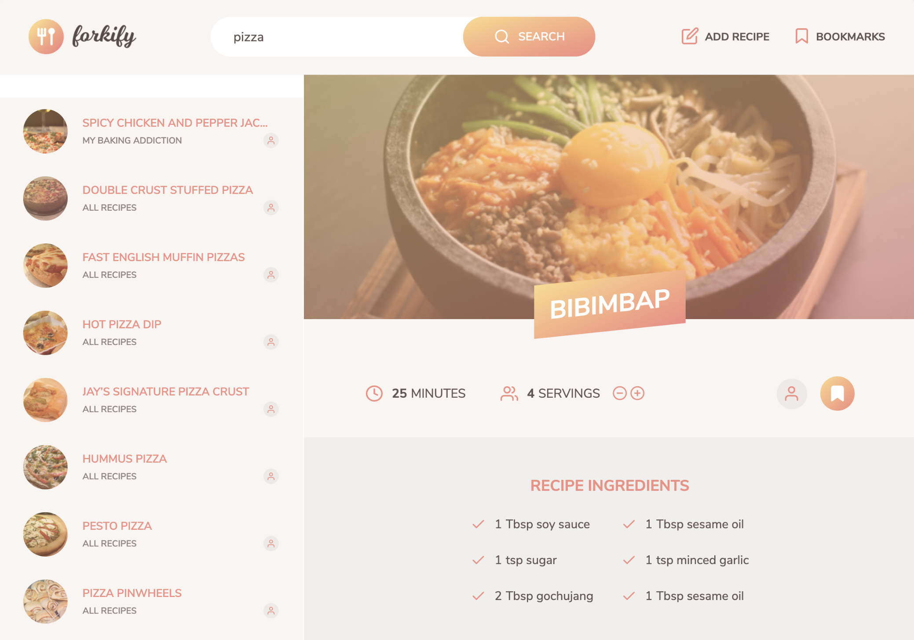

<h1 align="center">Forkify App</h1>

<p align="center">
  
</p>

<br/>
<br/>

## Description

### What's this?

with Forkify App, you can

- search and find recipes by keyword.
- add your own recipe and manage it.
- bookmark your favorite recipes.

### How to use this app

1. Start by searching for a recipe or an ingredient.
2. Turn the page to see next or previous 10 recipes.
3. Click a recipe you want to take a look at.
4. Change the number of servings then the amount of ingredients will automatically change.
6. Click Directions button to see how to cook it.
7. Click the bookmark icon to add or remove a bookmark.
8. You can add your own recipe by clicking 'add recipe' button.

### Technologies we used

- JavaScript
- Parcel
- ESLint
- Axios

### Sources

We used HTML/CSS Sources and Forkify API from the links below.<br/>
Then we designed our own MVC pattern and build it.
- HTML & CSS : [https://github.com/jonasschmedtmann/complete-javascript-course/tree/master/18-forkify](https://github.com/jonasschmedtmann/complete-javascript-course/tree/master/18-forkify)
- Forkify API : [https://forkify-api.herokuapp.com/v2](https://forkify-api.herokuapp.com/v2)

<br/>

## What we learned from this project

- Asynchronous JavaScript
- ES6 modules and module bundler Parcel
- HTTP requests using Axios
- MVC pattern programming

<br/>

## Project setup

```
npm install
npm start
```

<br/>

## Future scope

Split each input for ingredient into three

<br/>

## Reference

- Udemy JavaScript Course : https://www.udemy.com/course/the-complete-javascript-course/

<br/>
<br/>
